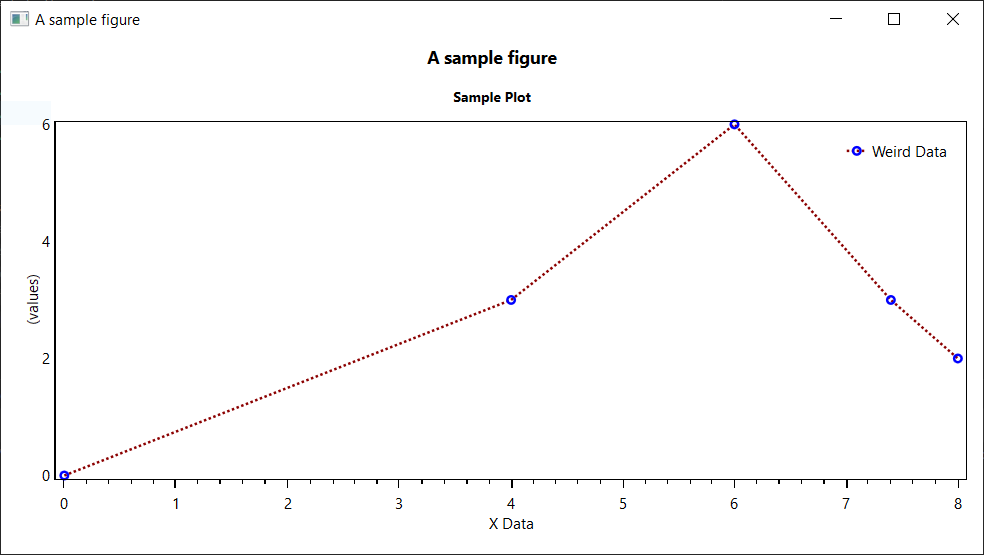

# OxyPlot.Fluent
An unofficial extension library for [OxyPlot](https://github.com/oxyplot/oxyplot) to create plots using a fluent API.

## ⚠ This library is still in development ⚠
The aim is not to cover all of OxyPlot's functionality with the API, there are too many different options and configurations possible. I'm purely aiming to eliminate some of the boilerplate/extra work that can go along with generating plots especially when testing a proof of concept.

This started off when I needed to convert some legacy code from MATLAB to .NET. In MATLAB I could just call `plot(x, y)` but I couldn't find anything slightly similar for .NET... so I decided to build something.

## For a flavour of what the aim is, take a look at the first test sample below
```c#
[STAThread]
private static void Main()
{
    Window window = Figure.Configure()
        .SetTitle("A sample figure")
        .WithPlot(p => p
            .SetTitle("Sample Plot")
            .WithLine(GetData(), s => s
                .SetTitle("Weird Data")
                .WithMarker(m => m
                    .SetType(MarkerType.Circle)
                    .SetFill(OxyColors.Transparent)
                    .SetStroke(OxyColors.Blue)
                    .SetStrokeThickness(2))
                .WithLine(l => l
                    .SetStyle(LineStyle.Dot)
                    .SetColour(OxyColors.DarkRed)))
            .WithLegend()
            .WithXAxis(a=>a
                .SetTitle("X Data"))
            .WithYAxis(a => a
                .SetTitle("(values)")
                .SetTickStyle(TickStyle.None)))
        .Build()
        .AsWindow();

    window.ShowDialog();
}

private static IEnumerable<DataPoint> GetData()
{
    yield return new DataPoint(0, 0);
    yield return new DataPoint(4, 3);
    yield return new DataPoint(6, 6);
    yield return new DataPoint(7.4, 3);
    yield return new DataPoint(8, 2);
}
```

The above sample produces something like this (using WPF on Windows 10) with no extra classes or code involved involved:


## Prefixes / Verbs
All extension methods for configuring the figure/plot use a restricted set of prefixes, by using a restricted set we can give each one a specific meaning and it makes it easier to filter down to the methods you're interested in using your favourite IDE.

| Prefix | Example | Usage |
|----|----|----|
| **With** | `WithLegend()` | Informs the configurator that the named sub-level should be included and provides an optional `Action<T>` to configure the sub-level |
| **Without** | `WithoutLegend()` | Informs the configurator that the named sub-level should not be included |
| **Set** | `SetTitle()` | Sets a property on the current level |
| **Unset** | `UnsetTitle()` | Informs the configurator that the property on the current level should not be included |
| **Use** | `UsePlotGrid()` | Sets one or more properties indirectly (use if setting multiple values or if the method sets a property to only one possible value like `UseSecondaryYAxis()`) |

## Configuration Behaviour
Configurators can exist in 3 states:
- `None` - Neither a `With` nor `Without` statement has been made, if the `Configure()` method is invoked the configurator should not change the state of the target
- `Include` - A `With` statement has been invoked to indicate that this configurator should apply any of it's properties that are in a `Set` state and should invoke all child configurators when `Configure()` is invoked
- `Exclude` - A `Without` statement has been invoked meaning that the configurator should configure the plot item to be hidden or removed (this state is not valid for all configurators because some items like Series are controlled by another configurator, in this example plot, this may cause an exception)

Configurator properties are bi-state, they can be `Set` or `Unset`. This was previously handled by using `null` for the unset state but it wasn't possible to determine if a reference type property (e.g. `string`) had been explicitly set to `null` or was just in it's initial state.